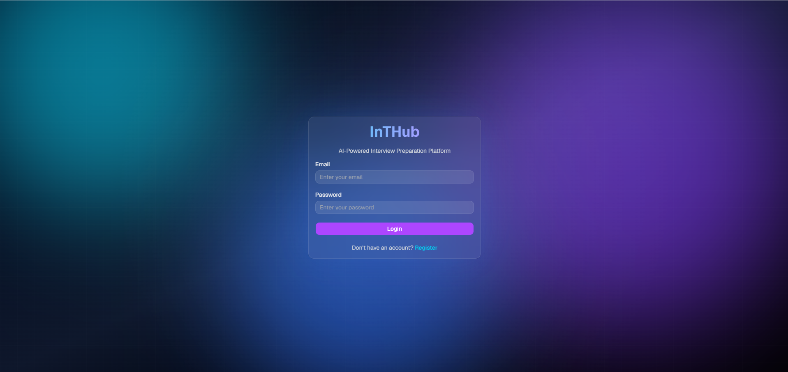
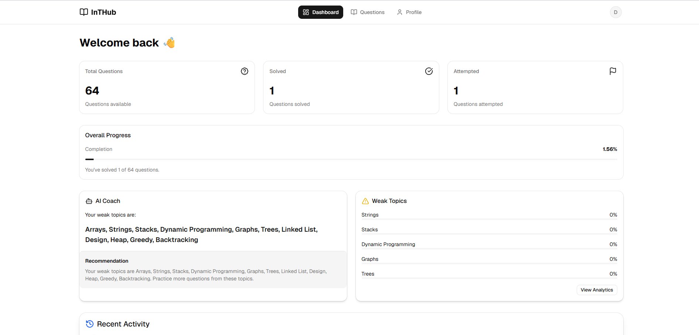
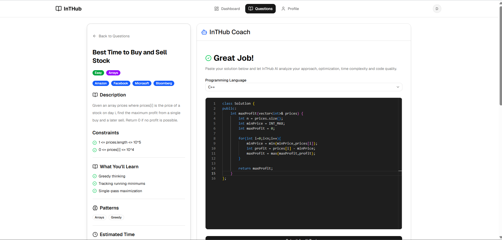
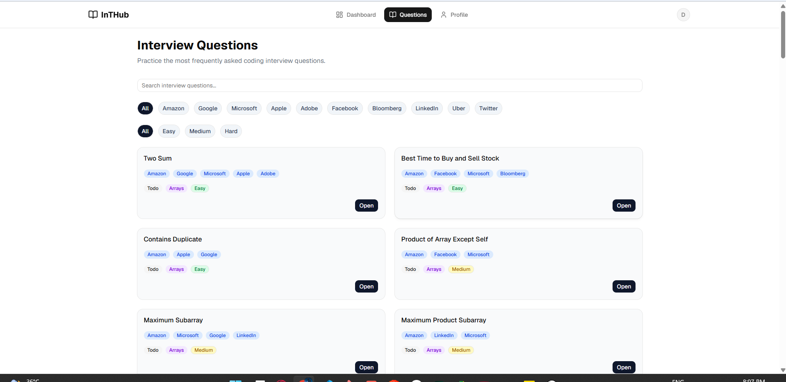
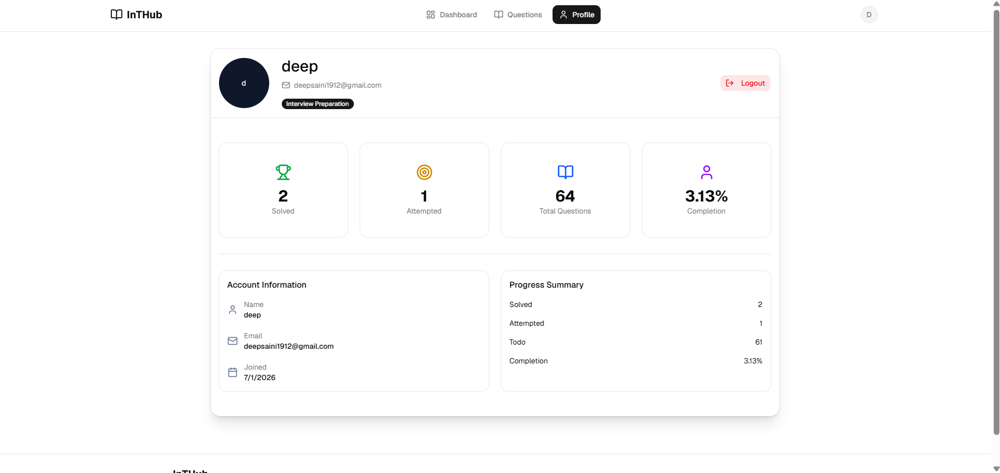

# InTHub 🚀

AI-powered interview preparation platform that helps users practice coding questions, track progress, and receive intelligent code reviews.

## Highlights

- 🤖 AI-powered code review using Groq LLM
- 📊 Personalized dashboard with progress analytics
- 🔐 Secure JWT authentication
- 📚 Coding question management
- 📈 Submission history with AI feedback
- 📱 Fully responsive interface

## Demo

Live Demo (Coming Soon)

## Screenshots

### Login

 
### Dashboard

 
### Learning Workspace

 
### Questions

 
### AI Code Review

 
### Profile


## Features

- JWT Authentication
- Secure Login & Registration
- Coding Question Library
- AI-powered Code Review
- AI Optimization Suggestions
- Time & Space Complexity Analysis
- Progress Tracking
- Dashboard Analytics
- Question Filtering
- Submission History
- Responsive UI

## Tech Stack

**Frontend**
- React
- Vite
- Tailwind CSS
- shadcn/ui
- Axios
- React Router

**Backend**
- Node.js
- Express.js
- JWT
- bcrypt
- Mongoose

**Database**
- MongoDB Atlas

**AI**
- Groq API
- Llama 3.3 70B

## Architecture

```
React
    ↓
Express API
    ↓
MongoDB Atlas

          ↓
      Groq LLM
```

## Folder Structure

```text
InTHub/
├── client/                 # React frontend
│   ├── src/
│   ├── .gitignore
│   ├── components.json
│   ├── eslint.config.js
│   ├── index.html
│   ├── jsconfig.json
│   ├── package.json
│   ├── README.md
│   └── vite.config.js
│
├── server/                 # Express backend
│   ├── config/
│   ├── controllers/
│   ├── data/
│   ├── middlewares/
│   ├── models/
│   ├── routes/
│   ├── scripts/
│   ├── services/
│   ├── util/
│   ├── validators/
│   ├── .env
│   ├── package.json
│   └── server.js
│
├── .gitignore
├── LICENSE
└── README.md
```

## Installation

**Frontend**
```bash
cd client
npm install
npm run dev
```

**Backend**
```bash
cd server
npm install
npm run dev
```

## Environment Variables

Create a `.env` file inside the `server/` directory:

```
PORT=

MONGO_URI=

JWT_SECRET=

GROQ_API_KEY=
```

> Do not commit actual values. Use `.env.example` as a template for contributors.

## API Overview

| Method | Endpoint       | Description                        |
|--------|----------------|-------------------------------------|
| POST   | `/register`    | Register a new user                |
| POST   | `/login`       | Authenticate user & return JWT     |
| GET    | `/questions`   | Fetch coding question library      |
| GET    | `/stats`       | Get dashboard analytics            |
| POST   | `/review`      | Submit code for AI review           |
| POST   | `/progress`    | Update user progress                |

## Future Improvements

- AI interview simulation
- Personalized learning roadmap
- Company-specific question sets
- Contest mode
- Streak tracking
- Leaderboards
- AI-generated practice questions
- Multiple AI providers
- Code execution support
- Docker deployment
- Redis caching
- Queue-based AI processing
- Admin dashboard

## Challenges Faced

- Designing a scalable question schema.
- Maintaining user progress efficiently.
- Integrating LLM responses into a structured JSON format.
- Building a responsive coding interface.
- Managing authentication securely using JWT.

## What I Learned

- REST API design
- Authentication with JWT
- MongoDB schema design
- AI API integration
- State management in React
- Responsive UI design
- Backend architecture
- Error handling
- API communication

## License

This project is licensed under the [MIT License](LICENSE).
